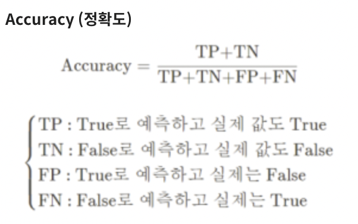

# COVID19 CT_Image Classification

주최 : 중소벤처기업진흥공단 / 주관 : 마인즈앤컴퍼니 (MNC)

## 대회 개요
- **대회 기간** : 2022년 02월 09일 12:00 PM ~ 2022년 02월 15일 12:00 PM
- **문제 정의** : 흉부 CT 이미지를 이용해 코로나19 감염 여부를 이진 분류
- **추진 배경**
	- 코로나 펜데믹 도래와 장기화에 따른 코로나 확진자 분류 필요성 증대
	- 의료 이미지 AI 기술 적용 가능성 확대

----------
- **평가 지표** 
	- **Accuracy (정확도)**

----------
## 문제 접근방법

### 주어진 train image가 645개밖에 되지 않아 deep learning이 불가능하다고 판단, Augmentation을 진행하였습니다.

## 1. Crop

Crop하여 동일한 데이터 여러번 학습 시킬 수 있어 Train양이 많아집니다. 

## 2. Clahe

이미지를 일정한 크기를 가진 작은 블록으로 구분, 블록별로 히스토그램 균일화를 시행하여 이미지 전체에 대해 균일화를 달성하는 Clahe를 통해 어두운 부분/ 밝은 부분 대비를 뚜렷하게 만듭니다.

### 모델 선정
CV에서 뛰어난 Resnet을 이용하려 했으나 overfitting이 쉽게 일어나는 모델인데다가 데이터가 많지 않기 때문에 
cnn모델을 이용하기로 하였습니다.
			
## 결과
Accuracy : 0.833

